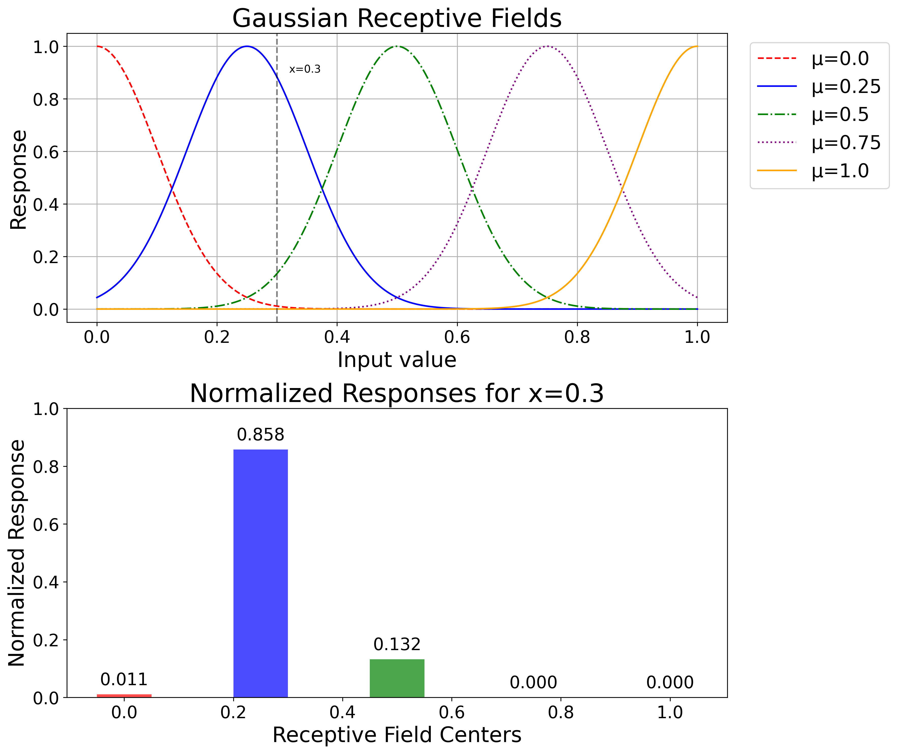

# Synthetic Dataset Classifier Visualization

This repository contains a Python script for generating and visualizing the decision boundaries of several machine learning classifiers. The script compares standard classifiers against custom implementations of Bi-directional Learning (BL) and a hybrid BL->BP model on three synthetic datasets: Moons, Circles, and Linearly Separable.

## Features

-   Generates three classic synthetic datasets for classification tasks.
-   Trains and compares five different classifiers:
    -   Support Vector Machine (SVM) with an RBF kernel
    -   Gaussian Process (GP) Classifier with an RBF kernel
    -   Multi-Layer Perceptron (MLP) with two hidden layers
    -   Bi-directional Learning (BL) with no hidden layer
    -   Hybrid BL then Backpropagation (BL→BP) with no hidden layer
-   Utilizes a Gaussian receptive field-based input expansion for the custom models, a technique that transforms the 2D input into a higher-dimensional space.
-   Produces a high-quality 3x6 comparison plot showing the input data and the resulting decision boundaries for each model on each dataset.

## Output Preview

The script generates the following visualizations, which are saved in the `results/` directory:

**Main Classifier Comparison (`visualization_synthetic.png`):**


**Input Expansion Demonstration (`input_expansion_demo_relu.png`):**


## How to Run

1.  **Clone the repository:**
    ```bash
    git clone https://github.com/Raziehkaveh76/classifier-decisionboundary-visualization.git
    cd classifier-decisionboundary-visualization
    ```

2.  **Set up a virtual environment (recommended):**
    ```bash
    python3 -m venv venv
    source venv/bin/activate
    ```

3.  **Install dependencies:**
    This command installs all the necessary libraries from the `requirements.txt` file.
    ```bash
    pip install -r requirements.txt
    ```

4.  **Run the script:**
    ```bash
    python Synthetic_visualization.py
    ```
    The script will first display a plot demonstrating the input expansion mechanism and then generate the main comparison plot, saving them to the `results/` directory.

## Model Details

-   **MLP**: A standard Multi-Layer Perceptron with two hidden layers, serving as a baseline deep learning model.
-   **BL (Bi-directional Learning)**: A custom model where the learning process updates both the model's weights and the input data representations simultaneously throughout all training epochs. This implementation uses a no-hidden-layer architecture applied to the expanded input space.
-   **BL→BP**: A hybrid model that employs Bi-directional Learning for the first half of the training epochs and then transitions to standard Backpropagation (updating only weights) for the remainder. This approach aims to first find a better data representation and then fine-tune the decision boundary. 